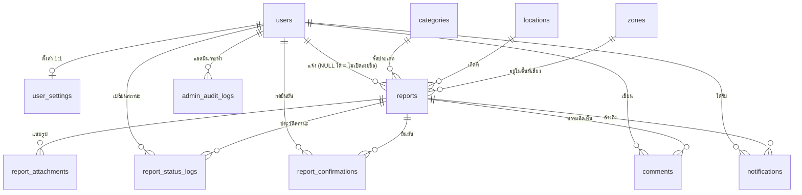

# RedZone — โครงสร้างฐานข้อมูล (Database Design)

เอกสารนี้อธิบายว่าฐานข้อมูลมีตารางอะไร เก็บอะไร เชื่อมกันอย่างไร และเหตุผลของการออกแบบ
เอาไปวางในบท "การออกแบบฐานข้อมูล" ของรายงาน SA ได้ทั้งบท

ไฟล์จริงอยู่ที่ `database/schema.sql` (โครงสร้าง) และ `database/seed.sql` (ข้อมูลตั้งต้น)
เอกสารนี้กับไฟล์ SQL ต้องตรงกันเสมอ — ถ้าแก้ไฟล์ใดไฟล์หนึ่งต้องแก้อีกไฟล์ตาม

---

## 1. ภาพรวม — 12 ตาราง แบ่งเป็น 4 กลุ่ม

| กลุ่ม | ตาราง | หน้าที่ |
|---|---|---|
| **คน** | `users` · `user_settings` | ใครใช้ระบบ · สิทธิ์ · การตั้งค่าส่วนตัว |
| **ข้อมูลอ้างอิง** | `categories` · `locations` · `zones` | ตัวเลือกตั้งต้นที่ไม่ค่อยเปลี่ยน |
| **งานหลัก** | `reports` · `report_attachments` · `report_status_logs` · `report_confirmations` · `comments` | รายงานเหตุการณ์และทุกอย่างที่ห้อยอยู่กับรายงาน |
| **ระบบ** | `notifications` · `admin_audit_logs` | การแจ้งเตือน · ประวัติการใช้อำนาจของผู้ดูแลระบบ |

ทั้งหมดใช้ `ENGINE=InnoDB` เพราะต้องการ **foreign key** และ **transaction**
และใช้ `utf8mb4_unicode_ci` เพื่อเก็บภาษาไทยและอิโมจิได้ครบ

---

## 2. ER Diagram



อ่านความสัมพันธ์เป็นภาษาคน

- ผู้ใช้ 1 คน แจ้งได้หลายรายงาน · แต่รายงาน 1 ใบมีผู้แจ้งได้คนเดียว (หรือไม่มีเลย)
- รายงาน 1 ใบ มีรูปแนบหลายรูป · มีคอมเมนต์หลายอัน · มีประวัติสถานะหลายแถว
- รายงาน 1 ใบ ผู้ใช้ 1 คนกดยืนยันได้ครั้งเดียว (บังคับด้วย composite primary key)

---

## 3. กลุ่ม "คน"

### 3.1 `users` — ตารางที่เป็นหัวใจของระบบสิทธิ์

| คอลัมน์ | ชนิด | เก็บอะไร |
|---|---|---|
| `user_id` | INT AI PK | เลขประจำตัวในระบบ ใช้อ้างอิงจากทุกตาราง |
| `username` | VARCHAR(20) UNIQUE | ชื่อที่ใช้ล็อกอิน (`a-z` `0-9` `.` `_`) |
| `student_code` | VARCHAR(20) UNIQUE | รหัสนักศึกษา/บุคลากร |
| `email` | VARCHAR(150) UNIQUE | ระบบสร้างจากรหัสนักศึกษา ใช้ส่งการติดต่อกลับ **ไม่ใช้ล็อกอิน** |
| `password_hash` | VARCHAR(255) | ผลลัพธ์ของ `password_hash()` เท่านั้น |
| `full_name` · `faculty` | VARCHAR | ชื่อ-นามสกุล · คณะ/หน่วยงาน |
| `role` | ENUM('user','admin') | **2 บทบาทเท่านั้น** ตรงกับ use case diagram |
| `is_active` | TINYINT(1) | `0` = ถูกระงับ ล็อกอินไม่ได้ (use case: ban user) |
| `ban_reason` | VARCHAR(255) | เหตุผลที่ถูกระงับ ผู้ใช้เห็นข้อความนี้ตอนล็อกอิน |
| `created_at` | DATETIME | วันที่สมัคร |

**ทำไม `role` ต้องอยู่ในฐานข้อมูล ไม่ใช่ในหน้าเว็บ** — ถ้าหน้าเว็บส่งบทบาทมาเอง ใครก็แก้
JavaScript แล้วบอกว่าตัวเองเป็น admin ได้ ระบบจึงอ่าน `role` จากแถวนี้แล้วเก็บลง
`$_SESSION['role']` ฝั่งเซิร์ฟเวอร์ และ `api/register.php` เขียน `role='user'` ตายตัว
ไม่รับค่าจากผู้ใช้ — **ไม่มีทางสมัครเป็น admin ได้** ต้องสร้างด้วยมือใน phpMyAdmin

**ทำไมต้อง `is_active` ไม่ลบแถวทิ้ง** — ถ้าลบผู้ใช้ รายงานและคอมเมนต์ที่เขาเคยเขียนจะเสียหาย
ตามไปด้วย การระงับด้วยธงจึงเก็บประวัติไว้ได้ครบและปลดระงับคืนได้

### 3.2 `user_settings` — ตั้งค่าส่วนตัว (1:1 กับ `users`)

เก็บ `notify_proximity` (เตือนเมื่อเข้าใกล้พื้นที่เสี่ยง) · `notify_status` (เตือนเมื่อสถานะเปลี่ยน) ·
`weekly_email` · `share_location` · `always_anonymous`

**ทำไมแยกตาราง ไม่รวมใน `users`** — `users` ถูก SELECT ทุกครั้งที่ตรวจสิทธิ์ (บ่อยมาก)
แต่ค่าตั้งค่าถูกอ่านแค่ตอนเปิดหน้าโปรไฟล์ แยกออกมาทำให้ตารางหลักเล็กและอ่านเร็ว
และเวลาเพิ่มตัวเลือกใหม่ก็ไม่ต้องแตะตารางที่สำคัญที่สุด
ลบผู้ใช้ → `ON DELETE CASCADE` ค่าตั้งค่าหายตามไปเอง

---

## 4. กลุ่ม "ข้อมูลอ้างอิง"

### 4.1 `categories` — ประเภทเหตุการณ์ (7 แถว)

`code` (`light`, `walk`, `harass`, `theft`, `traffic`, `flood`, `other`) · `name_th` · `name_en` · `is_active`

**`code` ต้องตรงกับ `RZ.CATS` ใน `assets/js/config.js`** เพราะหน้าเว็บอ้างด้วย code ไม่ใช่ id
**`is_active` ใช้ปิดประเภทที่เลิกใช้** โดยไม่ลบแถว — รายงานเก่าที่อ้างอยู่จะยังอ่านชื่อประเภทได้

### 4.2 `locations` — สถานที่ (18 แถว)

`name_th` · `name_en` · `building_code` · `latitude` · `longitude`
พิกัดเป็น `DECIMAL(10,7)` = ละเอียดถึงประมาณ 1 เซนติเมตร เกินพอสำหรับปักหมุด
**ห้ามใช้ `FLOAT`** เพราะเป็นเลขทศนิยมแบบประมาณ พิกัดจะเพี้ยนได้

ครอบคลุมทั้งในรั้ว (9 จุด) และนอกรั้วในรัศมี 10 กม. (9 จุด) ตามขอบเขตระบบ

### 4.3 `zones` — พื้นที่เสี่ยง (5 แถว)

`risk_level` (high/mid/low) · `center_lat` · `center_lng` · `radius_m` · `report_count` · `updated_at`
วาดเป็นวงกลมบนแผนที่ด้วย `L.circle([center_lat, center_lng], radius_m)`

`report_count` คือ **derived data** — คำนวณได้จากการนับ `reports` แต่เก็บซ้ำไว้เพื่อไม่ต้อง
`COUNT()` ใหม่ทุกครั้งที่โหลดแผนที่ ต้องมี job หรือ trigger อัปเดตค่านี้ ไม่งั้นจะเก่า

---

## 5. กลุ่ม "งานหลัก"

### 5.1 `reports` — ตารางหลักของระบบ

| คอลัมน์ | เก็บอะไร | หมายเหตุ |
|---|---|---|
| `report_id` | PK ภายใน | ใช้เชื่อมตารางลูก |
| `report_code` | `RZ-2569-0142` | **เลขที่ผู้ใช้เห็น** แยกจาก PK เพื่อไม่ให้เดาจำนวนรายงานทั้งระบบได้ |
| `user_id` | ผู้แจ้ง | **NULL = แจ้งแบบไม่เปิดเผยชื่อ** |
| `category_id` | ประเภท | FK → `categories` |
| `category_other` | ข้อความที่ผู้ใช้พิมพ์เอง | ใช้เมื่อเลือกประเภท `other` |
| `location_id` · `zone_id` | สถานที่ · พื้นที่เสี่ยง | NULL ได้ ถ้าปักหมุดจุดที่ไม่มีในรายการ |
| `severity` | high / mid / low | ใช้เลือกสีหมุดบนแผนที่ |
| `status` | sent / ack / prog / done / reject | **ความคืบหน้าที่ผู้แจ้งเห็น** |
| `is_approved` | 0 / 1 | **ผู้ดูแลระบบตรวจแล้วหรือยัง** |
| `title` · `description` | หัวเรื่อง · รายละเอียด | |
| `occurred_at` | เวลาที่พบเหตุ | ผู้ใช้กรอก — ต่างจาก `created_at` ที่เป็นเวลาที่กดส่ง |
| `latitude` · `longitude` | พิกัดที่ปักหมุด | |
| `is_anonymous` | 0 / 1 | ธงบอกว่าใบนี้เจตนาไม่เปิดเผยชื่อ |
| `reject_reason` | เหตุผลที่ไม่อนุมัติ | ผู้แจ้งเห็นข้อความนี้ |
| `confirm_count` | จำนวนคนกดยืนยัน | derived จาก `report_confirmations` |
| `created_at` · `updated_at` | เวลาบันทึก · เวลาแก้ล่าสุด | |

#### ★ จุดออกแบบสำคัญที่สุด — `status` กับ `is_approved` เป็น 2 คอลัมน์แยกกัน

สองเรื่องนี้เดินไม่พร้อมกัน ถ้ายัดรวมเป็นคอลัมน์เดียวจะแสดงผลผิดทันที

| | `status` | `is_approved` |
|---|---|---|
| ตอบคำถามว่า | เรื่องเดินไปถึงไหนแล้ว | ให้คนทั่วไปเห็นได้หรือยัง |
| ใครดู | ผู้แจ้ง (แถบติดตามสถานะ) | ระบบ (ตัวกรองแผนที่) |
| ตอนส่งรายงานใหม่ | `'prog'` — ผู้แจ้งเห็นว่าเรื่องเดินอยู่ | `0` — ยังไม่ขึ้นแผนที่ |
| ตอนแอดมินอนุมัติ | `'done'` | `1` |
| ตอนแอดมินไม่อนุมัติ | `'reject'` | `0` |

เงื่อนไข query ที่ตามมา

```sql
-- แผนที่สาธารณะ : เห็นเฉพาะที่ตรวจแล้ว
WHERE is_approved = 1 AND status <> 'reject'

-- คิวรอตรวจของแอดมิน : ยังไม่อนุมัติ และยังไม่ถูกปฏิเสธ
WHERE is_approved = 0 AND status <> 'reject'
```

#### ★ ความเป็นนิรนามถูกรับประกันด้วย "โครงสร้าง" ไม่ใช่ "การซ่อนที่หน้าจอ"

แจ้งแบบไม่เปิดเผยชื่อ → บันทึก `user_id = NULL` จริง ๆ ไม่ใช่เก็บชื่อไว้แล้วซ่อน
ผลคือแม้แต่คนที่เปิด phpMyAdmin ได้ก็สืบกลับไปหาผู้แจ้งไม่ได้ เพราะข้อมูลนั้น**ไม่มีอยู่**

ราคาที่ต้องจ่าย 2 ข้อ — ต้องอธิบายในรายงานว่ารู้ตัวและยอมรับ

1. ผู้แจ้งจะไม่เห็นรายงานใบนั้นในหน้า "รายงานของฉัน" และติดตามสถานะไม่ได้
2. ระบบส่งแจ้งเตือนกลับไปไม่ได้ เพราะไม่มี `user_id` ให้ส่งถึง

ในฟอร์มจึงมีสวิตช์ **"รับการติดต่อกลับ" ที่ล็อกเปิดไว้ตลอด** เพื่อให้เจ้าหน้าที่ติดต่อได้เสมอ

#### ★ นโยบาย `ON DELETE` ตั้งใจให้ต่างกันในแต่ละ FK

| FK | นโยบาย | เหตุผล |
|---|---|---|
| `user_id` → `users` | `SET NULL` | ลบบัญชีแล้วรายงานต้องอยู่ต่อ เพราะเป็นข้อมูลความปลอดภัยของส่วนรวม |
| `category_id` → `categories` | *(ไม่ตั้ง)* | ห้ามลบประเภทที่ยังมีรายงานอ้างอยู่ ให้ใช้ `is_active = 0` แทน |
| `location_id` · `zone_id` | `SET NULL` | ลบสถานที่/พื้นที่เสี่ยงได้ พิกัดยังอยู่ในตัวรายงานเอง |
| ตารางลูกทั้งหมด → `reports` | `CASCADE` | ลบรายงานแล้วรูป คอมเมนต์ ประวัติสถานะ ต้องหายตามไป ไม่ทิ้งขยะกำพร้า |

#### Index ที่ใส่ไว้และเหตุผล

`idx_report_status` · `idx_report_approved` · `idx_report_severity` · `idx_report_occurred`
ทั้ง 4 ตัวคือคอลัมน์ที่ปรากฏใน `WHERE` และ `ORDER BY` ของหน้าแผนที่และคิวแอดมิน
ซึ่งเป็น query ที่ถูกเรียกบ่อยที่สุดในระบบ

### 5.2 `report_attachments` — รูปแนบ (1 รายงานได้หลายรูป)

`file_path` · `file_size` · `mime_type` · `uploaded_at`

**ฐานข้อมูลเก็บแค่ path ไฟล์จริงอยู่ในโฟลเดอร์ `uploads/`** — ไม่เก็บไฟล์เป็น BLOB
เพราะจะทำให้ฐานข้อมูลบวมและสำรองข้อมูลช้ามาก
ตอนทำจริงต้องตรวจชนิดไฟล์จากเนื้อไฟล์ (ไม่ใช่จากนามสกุล) · เปลี่ยนชื่อไฟล์เป็นชื่อสุ่ม · จำกัดขนาด

### 5.3 `report_status_logs` — ประวัติการเปลี่ยนสถานะ

`from_status` · `to_status` · `changed_by` · `note` · `changed_at`

ใช้วาดแถบติดตามสถานะและตอบคำถามว่า "ใครเปลี่ยนสถานะนี้ ตอนไหน เพราะอะไร"
รายงานใหม่จะถูกเขียนลงตารางนี้ **3 แถวพร้อมกัน** (`sent` → `ack` → `prog`)
เพื่อให้ประวัติตรงกับแถบ 3 ขั้นที่ผู้ใช้เห็นทันทีที่ส่ง

### 5.4 `report_confirmations` — กดยืนยัน "ฉันพบเหตุนี้ด้วย"

```sql
PRIMARY KEY (report_id, user_id)
```

**composite primary key** ทำให้ 1 คนกดยืนยัน 1 รายงานได้ครั้งเดียว
กันการกดซ้ำที่ระดับฐานข้อมูล ไม่ต้องพึ่งการตรวจใน PHP หรือ JavaScript
เป็นตัวอย่างที่ดีของการใช้ constraint แทน validation — เอาไปเขียนในรายงานได้

### 5.5 `comments` — ความคิดเห็นใต้รายงาน

`content` (VARCHAR 500) · `is_hidden` · `hidden_by` · `created_at`

**ใช้ soft delete** — แอดมินกดลบคอมเมนต์ที่ไม่เหมาะสมแล้วเซตแค่ `is_hidden = 1`
พร้อมบันทึกว่าใครกด (`hidden_by`) แถวยังอยู่ในฐานข้อมูล
เพื่อให้ตรวจย้อนหลังได้ว่าลบอะไรไปและตัดสินใจถูกหรือไม่ และกู้คืนได้ถ้าลบผิด

Query ที่หน้าเว็บใช้จึงต้องมี `AND is_hidden = 0` ทุกครั้ง — **ลืมข้อนี้คอมเมนต์ที่ลบแล้วจะโผล่กลับมา**
Index `idx_comment_report (report_id, is_hidden)` รองรับ query นี้โดยตรง

---

## 6. กลุ่ม "ระบบ"

### 6.1 `notifications`

`user_id` · `type` (status/zone/new/done) · `title` · `message` · `ref_report_id` · `is_read`

**ทุกแถวต้องมี `user_id`** — การแจ้งเตือนเป็นของใครคนหนึ่งเสมอ
Index `idx_notify_unread (user_id, is_read)` ใช้นับตัวเลขแดงบนกระดิ่งได้เร็ว

```sql
SELECT COUNT(*) FROM notifications WHERE user_id = ? AND is_read = 0;
```

### 6.2 `admin_audit_logs` — ประวัติการใช้อำนาจของผู้ดูแลระบบ

`admin_id` (ใครทำ) · `action` · `target_type` · `target_id` · `reason` · `created_at`

`action` เป็น ENUM 7 ค่า : `approve_report` `reject_report` `delete_report`
`set_status` `hide_comment` `ban_user` `unban_user`

**ทำไมต้องมีตารางนี้** — `delete report` และ `ban user` กระทบผู้ใช้โดยตรงและย้อนกลับยาก
ถ้าไม่บันทึกไว้ ก็ตอบไม่ได้ว่าใครสั่ง และตรวจการใช้อำนาจเกินขอบเขตไม่ได้
ทุกฟังก์ชันใน `api/admin.php` จึงต้องเขียนแถวลงตารางนี้ทุกครั้ง

**`reason` บังคับกรอก** สำหรับ 4 การกระทำ — ไม่อนุมัติ · ลบรายงาน · ซ่อนคอมเมนต์ · ระงับบัญชี
ระบบปฏิเสธคำขอที่ไม่มีเหตุผลตั้งแต่ที่ `api/admin.php` (ฟังก์ชัน `need_reason()`)

---

## 7. หน้าเว็บไหนใช้ query อะไร

| หน้า | Query หลัก |
|---|---|
| แผนที่พื้นที่เสี่ยง | `reports WHERE is_approved = 1 AND status <> 'reject'` + `zones` ทั้งหมด |
| รายงานของฉัน | `reports WHERE user_id = ?` — `?` มาจาก `$_SESSION` **ไม่ใช่จากหน้าเว็บ** |
| การแจ้งเตือน | `notifications WHERE user_id = ?` |
| การ์ดรายละเอียด | `reports` + `comments WHERE report_id = ? AND is_hidden = 0` |
| แจ้งเหตุการณ์ใหม่ | `INSERT reports` (status `'prog'`, is_approved `0`) + `INSERT report_status_logs` 3 แถว |
| คิวรอตรวจสอบ (admin) | `reports WHERE is_approved = 0 AND status <> 'reject'` |
| รายงานทั้งหมด (admin) | `reports` ทั้งหมด `LEFT JOIN users` เพื่อดึงชื่อผู้แจ้ง |
| ผู้ใช้ระบบ (admin) | `users` ทั้งหมด + `COUNT(reports)` ต่อคน |
| ประวัติการจัดการ (admin) | `admin_audit_logs JOIN users ORDER BY created_at DESC` |

`LEFT JOIN users` สำคัญ — ต้องเป็น LEFT ไม่ใช่ INNER ไม่งั้นรายงานที่ `user_id = NULL`
(แจ้งแบบไม่เปิดเผยชื่อ) จะหายไปจากตารางของแอดมินทั้งหมด

---

## 8. เตรียมเชื่อมของจริง — ทำตามลำดับนี้

### ขั้นที่ 1 · สร้างฐานข้อมูล

1. เปิด XAMPP → Start **Apache** และ **MySQL**
2. วางโฟลเดอร์โปรเจกต์ใน `htdocs/redzone`
3. เปิด `http://localhost/phpmyadmin` → Import → เลือก `database/schema.sql`
4. Import `database/seed.sql` ต่อ (**ต้องเรียงลำดับนี้** เพราะ seed อ้าง FK ของ schema)
5. เปิด `http://localhost/redzone/` ตรวจว่าเว็บยังทำงานปกติ

### ขั้นที่ 2 · สร้างรหัสผ่านของ admin ให้ถูก

`seed.sql` ใส่ hash ตัวอย่างไว้ซึ่ง **ใช้ล็อกอินจริงไม่ได้** ต้องสร้างใหม่

```bash
php -r "echo password_hash('รหัสที่ต้องการ', PASSWORD_DEFAULT);"
```

แล้วนำค่าที่ได้ไป `UPDATE users SET password_hash = '...' WHERE username = 'admin';`

### ขั้นที่ 3 · ตั้งค่าการเชื่อมต่อ

แก้ `api/config/db.php` — ค่าตั้งต้นของ XAMPP คือ user `root` รหัสว่าง
**ไฟล์นี้อยู่ใน `.gitignore` แล้ว ห้ามขึ้น GitHub** ถ้าจะแชร์ให้ทำ `db.example.php`
ที่ใส่ค่าปลอมไว้แทน

### ขั้นที่ 4 · เปิด `fetch()` ทีละฟังก์ชัน

ใน `assets/js/api.js` มีโค้ด `fetch()` ตัวจริงคอมเมนต์ไว้ใต้ทุกฟังก์ชันแล้ว
**เริ่มจาก `getIncidents()` ตัวเดียวให้ผ่านก่อน** แล้วค่อยทำตัวถัดไป
อย่าเปิดพร้อมกันหมด เพราะถ้าพังจะไม่รู้ว่าพังที่ไหน

ฟังก์ชันที่กลายเป็น `async` ต้องแก้ผู้เรียกให้ `await` ด้วย

### ขั้นที่ 5 · สิ่งที่ยังต้องทำก่อนใช้งานจริง

- [ ] ตรวจรัศมี 10 กม. ที่ฝั่ง PHP ด้วย (ตอนนี้ตรวจแค่ใน JavaScript ซึ่งแก้ได้)
- [ ] อัปโหลดรูปจริง — ตรวจชนิดไฟล์ · เปลี่ยนชื่อไฟล์ · จำกัดขนาด
- [ ] ยืนยันตัวตนว่าเป็นคน มจพ. จริง — ส่งลิงก์ยืนยันไปที่อีเมลมหาวิทยาลัยก่อนเปิดใช้บัญชี
- [ ] จำกัดจำนวนครั้งที่ล็อกอินผิด — นับต่อ IP/ชื่อผู้ใช้ แล้วหน่วงเวลา
- [ ] job อัปเดต `zones.report_count` และ `reports.confirm_count`
- [ ] HTTPS — ตอนนี้เป็น http บน localhost ระบบจริงต้องเป็น https ไม่งั้นรหัสผ่านวิ่งเป็นข้อความเปล่า
- [ ] สำรองฐานข้อมูลอัตโนมัติ

---

## 9. สรุปหลักการออกแบบที่ใช้ (ตอบอาจารย์ได้)

1. **แยกคอลัมน์ตามคำถามที่มันตอบ** — `status` ตอบว่าเรื่องเดินถึงไหน `is_approved` ตอบว่าเปิดเผยได้หรือยัง คนละคำถามต้องคนละคอลัมน์
2. **ความเป็นส่วนตัวออกแบบที่โครงสร้าง** — ไม่เก็บสิ่งที่ไม่ควรมี ดีกว่าเก็บแล้วซ่อน
3. **ใช้ constraint แทนการตรวจในโค้ด** — composite PK กันกดยืนยันซ้ำ · UNIQUE กันชื่อผู้ใช้ซ้ำ · FK กันข้อมูลกำพร้า ฐานข้อมูลบังคับให้ ไม่มีทางลืม
4. **soft delete สำหรับสิ่งที่ต้องตรวจย้อนหลัง** — คอมเมนต์และบัญชีผู้ใช้ ใช้ธงแทนการลบแถว
5. **บันทึกทุกการใช้อำนาจ** — `admin_audit_logs` พร้อมเหตุผลบังคับกรอก ทำให้ระบบตรวจสอบตัวเองได้
6. **ตรวจสิทธิ์ที่เซิร์ฟเวอร์เท่านั้น** — การซ่อนเมนูในหน้าเว็บไม่ใช่ความปลอดภัย ทุกไฟล์ใน `api/` ต้องเรียก `require_login()` และไฟล์ของแอดมินต้องเรียก `require_role('admin')`
